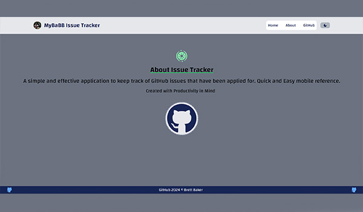

# 💼 [GitHub Issue Tracker](https://mybabb.github.io/Github_Issue_Tracker/)

**GitHub Issue Tracker** is a user-friendly and efficient job application tracker designed to streamline your job search process.

## 📝 Documentation

The documentation is segmented into these sections:

- [Description](#-description)
- [Features](#-features)
- [Installation](#%EF%B8%8F-installation)
- [Usage](#-usage)
- [Contributing](#-contributing)
- [License](#-license)
- [Contact](#%EF%B8%8F-contact)

## 👀 Description

**GitHub Issue Tracker** simplifies the task of managing your job applications by providing a convenient platform where you can input and track the jobs you've applied to. Say goodbye to scattered notes and disorganized spreadsheets – with **GitHub Issue Tracker**, focus on securing your ideal job!

## ✨ Features

- **Job Application Management:** Input and manage the details of the jobs you've applied to, like including Repository name, job title or application status.

## 🛠️ Installation

To install **GitHub Issue Tracker**, follow these steps:

1. Clone the repository:

    ```bash
    git clone https://github.com/MyBaBB/Github_Issue_Tracker
    ```

2. Navigate to the project directory:

    ```bash
    cd GitHub Issue Tracker
    ```

3. Install dependencies:

    ```bash
    npm install
    ```

## 🚀 Usage

To use **GitHub Issue Tracker** locally, run the following command:

```bash
npm run dev
````

Now you should be able to access it at `localhost:5173`.

## 🤝 Contributing

We welcome contributions to **GitHub Issue Tracker**! While the project is still in its early stages, it will continue to grow and evolve with time.

For guidelines on contributing, please refer to [CONTRIBUTING.md](CONTRIBUTING.md). 🤗

## 📄 License

This project is licensed under the terms of the [MIT License](LICENSE).

## ☎️ Contact

If you have any questions or suggestions, feel free to reach out:

<p align="left">

